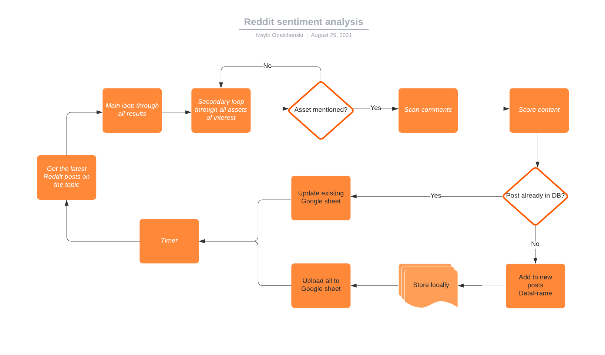

# Reddit sentiment analyser

Python script that scans Reddit posts and comments and summarizes information about the activity and the sentiment on specidic topics. It loops through Reddit posts and comments, and looks for a set of key words to shortlist the relevant ones for analysis. Example for topic would be Cryptocurrencies. Example for key words would be: BTC, ETH, ADA etc... 

A score is applied to each post and cooment in order to get the overall sentiment for the assets of interest. For the purpose of this example, all results are stored locally and in a Google sheet. An example of vizualization of the stats is avaliable through Google data studio dashboard.

The focus is on Crypto, but it can be easily modified to analyse any topic if we replace the dual approach sentiment scoring system with just Vader analysis.
 
#### Google Sheet data
https://docs.google.com/spreadsheets/d/1S8RC6zd7p7ZyxTJBSZs81DrF8Wk9Rx77-zJ_sgU4fzE/edit?usp=sharing

#### Google Data studio visualization
https://datastudio.google.com/reporting/afb6ede0-f8fe-41bb-982a-28788050a3cf
 
 
## Motivation
This is a job interwiev project.

### Build status
Version 1

### Requirements
Python 3.7

#### Used libraries:
Praw (Reddit API solutiuon) https://github.com/praw-dev/praw

pygsheets (Google Sheets API solution) https://pygsheets.readthedocs.io/en/stable/index.html

Pandas https://pandas.pydata.org/

nltk https://www.nltk.org

### Functionality

The script is capable of acquiring Reddit posts, filtering and splitting the text into words. Then the text of the comments and the cleaned sets of words are analysed for positive/negative bias of the Reddit user that created the post and scored.

#### Two scoring approaches:

A. nltk Vader module. That's a scoring approach that uses word lexicons to score texts. The score output is in the range -1 to 1 

B. My own approach that is scanning the text for specific words that are passed to the script. For the purpose of this example project I created two short lists with positive and negative words in the context of crypto trading. This list is to be improved by optimization for real world use. I also normalize the scores to a range between -1 and 1. The function that does that is part of the TextAnalyser class.

    def score_post(self, words):
        """
        Scores the derived from the text based on predefined set of positive / negative words.
        :inputs: list
        :returns: dict

        words - list of cleaned words (str) from the content of the post
        """

        # Count number of positive words
        positive_words_count = len([w for w in words if w in self.positive])

        # Count number of negative words
        negative_words_count = len([w for w in words if w in self.negative])

        # Calculate the score
        if words:
            score = ((positive_words_count - negative_words_count) / len(words)) * 100

            # Normalize the scores similarly to Vader in order for the two scores to be comparable
            normalized_score = score/math.sqrt((score * score) + 10)

            return {
                "overall": normalized_score,
                "positive": positive_words_count,
                "negative": negative_words_count,
                "words_count": len(words)
                }

#### Final score = ( score A + score B) / 2

All individual posts with their respective stats are stored in Google sheet for this example project. For real world use I would store them in a database. 

The script is designed to run every 24 hours and analyse up to 1000 most recent posts (that's Reddit API limit). So far from the debugging I can tell that this is about day and a half worth of relevent crypto posts. It keeps track of which posts we already have in record, so if it scans one of them again, it updates the existing entry for any new comments / score change instead of creating double entries.

The Dashboard allows filter by date or asset.

### Flow chart

